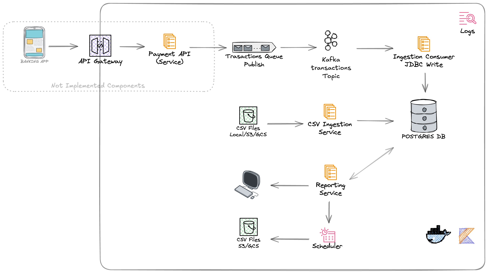

# Bank Transaction Core

Kotlin mockup application to manage payment transactions, supporting database migrations, CSV file ingestion and reporting.

### 🌐 Overview

- Language: Kotlin (JVM)
- Database: PostgreSQL (via Docker)
- Migration: Flyway (via Kotlin runner)
- Ingestion: CSV import using JDBC + HikariCP
- Data Stream: Kafka (via Docker)

### 📦 Database Schema

• The schema or DDL of the data base is created under the Flyway repository folder:
[Please find it here!](bank-core-fc/bank-transaction-core/app/src/main/resources/db/migration/V1__init.sql)
    
• Flyway tracks applied migrations in flyway_schema_history, so for the V1 and V2 we split definition of tables and insert statements

### 📄 CSV File Format

•	[Find an example here!](app/src/main/resources/data/transactions.csv)
•	Columns (header row required):
	1.	transaction_id (string 8-4-4-4-12)
	2.	sender_id      (string 8-4-4-4-12)
	3.	receiver_id    (string 8-4-4-4-12)
	4.	amount         (decimal)
	5.	currency       (3-letter code)
	6.	timestamp      (ISO-8601 with Z)
	7.	status         (pending|completed|failed)

Rows with invalid UUIDs are skipped; amounts >10,000 are flagged as suspicious in the logs and also set True for flag_suspicious.

# What does the system look like?




# 🚀 Let's Start

### Prerequisites

- Java 21 (OpenJDK)
- Docker & Docker Compose
- Git

### Quick Start - The quick way of getting started
- This is the fastest way to go, please navigate in your terminal to the root folder of the project and cd into this folder: *bank-transaction-core*

1) We will rapidly use the Makefile and execute the following command, this will start all the components needed (keep the terminal open and work in a new one after this).
```
make up
```
2) Please check that the components are all up from a new terminal- you should see these:

>bankcore-kafka (Kafka Consumer)
>pgadmin (GUI for Postgres)
>bankcore-postgres (The DB)
>bankcore-zk (ZooKeeper)

3) Test the CSV Importer
- The repository already has a path and a file fix coded we can easily ingest it like this:

```
make ingest-csv
```
- You should see something similar like this:

>INFO  c.bankcore.payments.JdbcCSVImporter - Starting import from src/main/resources/data/transactions.csv
>WARN  c.bankcore.payments.JdbcCSVImporter - Suspicious transaction b1d4e5f4-34f5-a7b6-c9d8-e4f5a6b7c8d9 over threshold: 10500.00
>INFO  c.bankcore.payments.JdbcCSVImporter - Imported 44 records.
>INFO  c.bankcore.payments.JdbcCSVImporter - Import complete.

4) Publish a Message to the Transaction's topic
- There is a pre-written JSON object-message that will be sent and processed by the Kafka consumer

```
make ingest-json
```

- If you navigate to the logs folder, you should be able to see the activity of the consumer and find something like this:

```
cat app/logs/jdbc-service.log  
```

-- Please see the suspicious transaction, you could also check the Postgres Database and see the new inserted row
>2025-08-03 21:21:47 INFO  com.bankcore.payments.JdbcService - Stream inserted event 08e63665-3709-4bdc-9e95-49d7fc0633fd from JSON g7a1e5b1-01a2-d4e3-f8a9-b1c2d3e4f4t6
>2025-08-03 21:42:37 INFO  com.bankcore.payments.JdbcService - Stream inserted event 8f7e8308-e7f0-4a39-a394-871e8e38136c from JSON a4rf65e1-01a2-d4e3-y9p9-b1c2d3e4f4t6
>2025-08-03 21:47:37 WARN  com.bankcore.payments.JdbcService - Suspicious transaction via stream e23e0704-8afb-4eec-a623-af9e12f7339d over threshold: 32099.00
>2025-08-03 21:47:37 INFO  com.bankcore.payments.JdbcService - Stream inserted event e23e0704-8afb-4eec-a623-af9e12f7339d from JSON f7d355e1-04a3-e4f3-y7p7-b62d3o4fft5

5) Do some quick Reporting
- You can call different custom-made reports see in the Makefile for more examples

```
make report ARGS="daily-totals 8e2f3a10-2a3b-5c4d-7e6f-2a3b4c5d6e7f 2022-04-01 2025-08-03"
```

Your report will be old-school printed and should be shown like this:

>DailyTotal(userId=8e2f3a10-2a3b-5c4d-7e6f-2a3b4c5d6e7f, date=2025-05-01, sentTotal=0, receivedTotal=0)
>DailyTotal(userId=8e2f3a10-2a3b-5c4d-7e6f-2a3b4c5d6e7f, date=2025-05-02, sentTotal=0, receivedTotal=0)
>DailyTotal(userId=8e2f3a10-2a3b-5c4d-7e6f-2a3b4c5d6e7f, date=2025-05-03, sentTotal=0, receivedTotal=0)
>DailyTotal(userId=8e2f3a10-2a3b-5c4d-7e6f-2a3b4c5d6e7f, date=2025-05-04, sentTotal=0, receivedTotal=0)
>DailyTotal(userId=8e2f3a10-2a3b-5c4d-7e6f-2a3b4c5d6e7f, date=2025-05-05, sentTotal=0, receivedTotal=400.00)
>DailyTotal(userId=8e2f3a10-2a3b-5c4d-7e6f-2a3b4c5d6e7f, date=2025-05-06, sentTotal=100.00, receivedTotal=0)
>DailyTotal(userId=8e2f3a10-2a3b-5c4d-7e6f-2a3b4c5d6e7f, date=2025-05-07, sentTotal=0, receivedTotal=0)
>DailyTotal(userId=8e2f3a10-2a3b-5c4d-7e6f-2a3b4c5d6e7f, date=2025-05-08, sentTotal=0, receivedTotal=0)
>DailyTotal(userId=8e2f3a10-2a3b-5c4d-7e6f-2a3b4c5d6e7f, date=2025-05-09, sentTotal=1650.00, receivedTotal=1500.00)

### Slow Start - The manual way of getting to know the system...

- The first 4 steps will create the services that the system supports, the following sections will tackle 1 by 1 the tasks given:

1.	Clone the repo, clean possible old outputs and compile code

```
git clone [<repository-url>](https://github.com/sfandino/bank-core-fc.git) && cd bank-transaction-core
```

- Here we clean and compile code - we create artifacts here for later execution
```
./gradlew :app:clean :app:build
```


3.	Start PostgreSQL + PgAdmin

```
docker compose up -d	
```

4.	Apply database migrations

```
./gradlew :app:flywayMigrateManual
```

- Creates users, currencies, transactions tables and also inserts User and currency data


## CSV Importer

The system supports importing transaction data via CSV file - (it writes the data in PostgreSQL)

5.	Import transactions from CSV

```
./gradlew :app:importCsv
```

- Reads transactions.csv, inserts into transactions table,
	skips duplicates, flags suspicious amounts.

6.	Monitor logs
- Console: output appears during importCsv task run
- File: tail -f logs/import.log
- [Read also here!](bank-core-fc/bank-transaction-core/app/logs/import.log)

## Queue Data Ingestion
The system listens to a data stream through a Kafka topic *transactions* - the sink is the PostgreSQL data base.

7. Creating a Kafka listener and Publish a Test message

- Creating the listener - I recommend you do this on a extra tab in your terminal

```
docker exec -it bankcore-kafka \
  kafka-topics --create \
    --topic transactions \
    --bootstrap-server localhost:9092 \
    --replication-factor 1 \
    --partitions 1
```
- The consumer needs to be started to listen to any incoming message

```
./gradlew :app:runKafkaConsumer
```
- Publish a message / In real life we would have a data stream connected sending this kind of messages - the JSON supported shown below in the example

```
docker exec -i bankcore-kafka kafka-console-producer \
  --topic transactions \
  --bootstrap-server localhost:9092 <<EOF
{"transaction_id":"g7a1e5b1-01a2-d4e3-f8a9-b1c2d3e4f4t6","sender_id":"8b2f3c21-2d3e-5f4a-9b8c-2d3e4f5a6b7c","receiver_id":"7a1e2b10-1c2d-4e3f-8a9b-1c2d3e4f5a6b","amount":50000.00,"currency":"USD","timestamp":"2025-08-03T18:00:00Z","status":"completed"}
EOF
```
- This row should be inserted into PostgreSQL, and also should have triggered the warning for suspicious transaction
- You could have a look at the tab where the consumer was launched, it should show some activity
- You could also login into the data base and check the new ingested row

## Reporting
The system has an extra task which support reporting we could report on 2 different levels:

9) 1. You can report all the payments (sent and receive) of a concrete customer within a time frame
   Please make sure that the user and the transactions exists on the database (step 4. is required here)

The format of the request is: "payments user_id start_date_transactions end_date_transactions" (Dates are strictly given as a timestamp)

```
./gradlew :app:report --args="payments 8e2f3a10-2a3b-5c4d-7e6f-2a3b4c5d6e7f 2025-04-01T00:00:00Z 2025-08-04T00:00:00Z"
```

10) 2. You can report daily totals for a user (sent and receive) of a concrete customer within a time frame

The format of the request is: "daily-totals user_id start_date_transactions end_date_transactions"

```
./gradlew :app:report --args="daily-totals 8e2f3a10-2a3b-5c4d-7e6f-2a3b4c5d6e7f 2025-04-01 2025-08-03"
```

## Scheduling
The idea is to create a recurrent execution of a task - we will schedule the creation of a report that makes sense to deliver on a daily basis at 5:00 UTC:

10) For the sake of having a schedule, we have a daily report which return the total balance for each user from the day before

- You can test the report manually with the command below
```
./gradlew :app:report --args="all-users-balance 2025-05-03"
```
- Now, while having a report to be created under a schedule, we have the scheduler implemented with Quartz
- To test the scheduler properly, I recommend you to change the cron time to a time in the future today, so you dont need to wait till next day until 5 am ^^
- Make your changes and start the scheduler with the following command - I recommend running this command in a new tab, since will be running actively

```
./gradlew :app:runQuartzScheduler
```
-- When the scheduler runs the job, this would print the Report on the command line, but I think something that makes sense is to export it as PDF and either store it on a path or send it via Email, 
the possibilities here are infinite, so depending of the business case, we could implement it. 

## Trouble Shooting

- Always makesure that your code compiles after building the app

```
./gradlew :app:build 
```
or even better

```
./gradlew :app:clean :app:build
```

- You can also makesure that the ingestion tasks are being listed with this command (or reporting task as well if you change the command)

```
./gradlew :app:tasks --group ingestion
```

- This project has a consistent volume for Postgres, which means your data will be consistent even if you do a compose down
but if you want to start again from scratch, you can wipe out the volume with the following command:

```
docker compose down -v
```

- Perhaps one of the services in the docker is down? Check them like this:

```
docker ps -a 
```
You should have the following items listed:

	bankcore-kafka (Kafka Consumer)
	pgadmin (GUI for Postgres)
	bankcore-postgres (The DB)
	bankcore-zk (ZooKeeper)